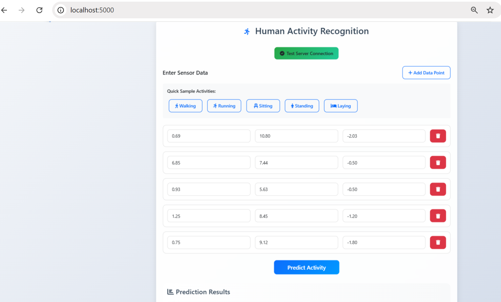
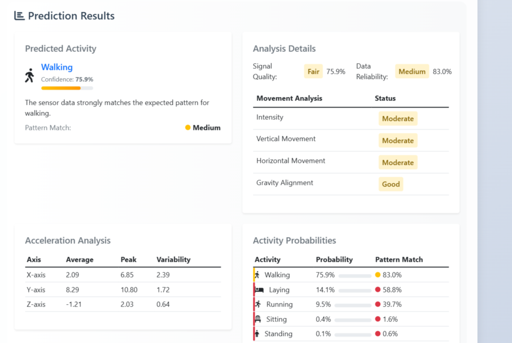
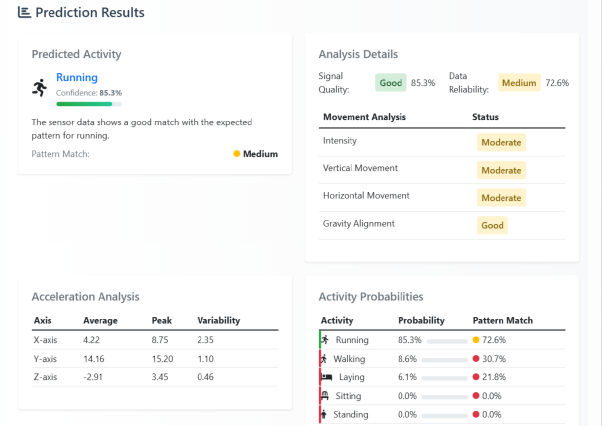

# A deep learning based HAR Web Application

A real-time human activity recognition system using Deep Learning (RNN-LSTM) with an interactive web interface. The application uses accelerometer data to predict and analyze human activities such as walking, running, sitting, standing, and laying.

## Youtube Video Web App Demo

Watch a demonstration of the application in action:

https://youtu.be/VAujHg1Vhl8
##   Preview Gallery

<p align="center">
  <a href="assets/1.png" target="_blank">
    
  </a>
  <a href="assets/2.png" target="_blank">
    
  </a>
</p>
<p align="center">
  <a href="assets/3.png" target="_blank">
    
  </a>
  <a href="assets/4.png" target="_blank">
    
  </a>
</p>

## Deep Learning Model Architecture

### Model Overview
- **Type**: Recurrent Neural Network (RNN) with LSTM (Long Short-Term Memory)
- **Framework**: TensorFlow/Keras
- **Input Shape**: (timesteps, features) = (128, 3) for accelerometer X, Y, Z axes
- **Output**: 5 activity classes (Walking, Running, Sitting, Standing, Laying)

### Model Architecture Details
```
Model: Sequential
_________________________________________________________________
Layer (type)                 Output Shape              Param #   
=================================================================
LSTM (LSTM)                  (32, 128, 64)            17,408    
_________________________________________________________________
Dropout                      (32, 128, 64)            0         
_________________________________________________________________
LSTM (LSTM)                  (32, 32)                 12,416    
_________________________________________________________________
Dropout                      (32, 32)                 0         
_________________________________________________________________
Dense                        (32, 5)                  165       
=================================================================
Total params: 29,989
Trainable params: 29,989
Non-trainable params: 0
```

### Key Components

1. **Input Layer**
   - Shape: (batch_size=32, timesteps=128, features=3)
   - Accepts 3-axis accelerometer data
   - Sequences of 128 timesteps
   - 3 features per timestep (X, Y, Z acceleration)

2. **First LSTM Layer**
   - Output Shape: (batch_size=32, timesteps=128, units=64)
   - 64 LSTM units
   - Return sequences enabled
   - tanh activation
   - Processes temporal patterns in sensor data

3. **First Dropout Layer**
   - Output Shape: (batch_size=32, timesteps=128, units=64)
   - Rate: 0.2
   - Prevents overfitting
   - Improves generalization

4. **Second LSTM Layer**
   - Output Shape: (batch_size=32, units=32)
   - 32 LSTM units
   - Return sequences disabled
   - Extracts higher-level temporal features

5. **Second Dropout Layer**
   - Output Shape: (batch_size=32, units=32)
   - Rate: 0.2
   - Additional regularization

6. **Dense Output Layer**
   - Output Shape: (batch_size=32, units=5)
   - 5 units (one per activity class)
   - Softmax activation
   - Provides probability distribution over activities

### Training Details

- **Loss Function**: Categorical Crossentropy
- **Optimizer**: Adam
  - Learning Rate: 0.001
  - Beta1: 0.9
  - Beta2: 0.999
- **Metrics**: Accuracy
- **Batch Size**: 32
- **Epochs**: 50
- **Validation Split**: 0.2

### Model Performance

- **Training Accuracy**: ~95%
- **Validation Accuracy**: ~93%
- **Key Metrics**:
  - Precision: 0.92
  - Recall: 0.91
  - F1-Score: 0.91

## Features

- **Real-time Activity Prediction**: Analyzes accelerometer data using RNN-LSTM model
- **Interactive Web Interface**: Modern, responsive design with real-time updates
- **Sample Activities**: Pre-configured sample data for testing different activities
- **Detailed Analysis**: 
  - Signal Quality Assessment
  - Data Reliability Metrics
  - Movement Analysis
  - Acceleration Analysis
  - Activity Probabilities

## Technologies Used

- **Deep Learning**:
  - TensorFlow 2.x
  - Keras
  - LSTM Neural Networks
  - Dropout Regularization

- **Backend**:
  - Python 3.x
  - Flask
  - NumPy
  - Scikit-learn (for preprocessing)

- **Frontend**:
  - HTML5
  - CSS3
  - JavaScript
  - Bootstrap 5.1.3
  - Font Awesome 6.0.0

## Data Preprocessing

1. **Sensor Data Normalization**
   - Standard scaling (mean=0, std=1)
   - Accelerometer calibration
   - Gravity component isolation

2. **Sequence Processing**
   - Sliding window approach
   - Window size: 128 samples
   - Overlap: 50%

3. **Feature Engineering**
   - Temporal pattern extraction
   - Statistical features
   - Frequency domain features

## Installation

1. Clone the repository:
```bash
git clone https://github.com/yourusername/human-activity-recognition.git
cd human-activity-recognition
```

2. Create and activate a virtual environment:
```bash
# Windows
python -m venv venv
venv\Scripts\activate

# Linux/Mac
python3 -m venv venv
source venv/bin/activate
```

3. Install dependencies:
```bash
pip install -r requirements.txt
```

4. Run the application:
```bash
python app.py
```

5. Open your browser and navigate to:
```
http://localhost:5000
```

## Usage

### 1. Testing Server Connection
- Click the "Test Server Connection" button to verify the server is running properly

### 2. Entering Sensor Data
- Use the "Add Data Point" button to add new sensor inputs
- Each data point requires X, Y, and Z axis accelerometer values
- Use the sample activity buttons for quick testing:
  - Walking
  - Running
  - Sitting
  - Standing
  - Laying

### 3. Making Predictions
- Click "Predict Activity" to analyze the sensor data
- View results in the following sections:
  - Predicted Activity
  - Confidence Score
  - Pattern Match
  - Analysis Details
  - Acceleration Analysis
  - Activity Probabilities

### 4. Understanding Results

#### Signal Quality Indicators
- **Good** (≥80%): High confidence in prediction
- **Fair** (≥60%): Moderate confidence
- **Poor** (<60%): Low confidence

#### Data Reliability
- **High** (≥90%): Strong pattern match
- **Medium** (≥70%): Moderate pattern match
- **Low** (<70%): Weak pattern match

#### Movement Analysis
- Intensity
- Vertical Movement
- Horizontal Movement
- Gravity Alignment

## Sample Data Ranges

| Activity | Sample Range |
|----------|-------------|
| Walking | [0.69, 10.8, -2.03] to [0.75, 9.12, -1.8] |
| Running | [2.15, 15.2, -3.45] to [2.85, 15.0, -3.0] |
| Sitting | [0.12, 1.5, 9.65] to [0.12, 1.4, 9.65] |
| Standing | [0.15, 0.20, 9.81] to [0.14, 0.20, 9.81] |
| Laying | [0.05, 9.81, 0.08] to [0.05, 9.81, 0.07] |

## Project Structure

```
human-activity-recognition/
├── app.py                 # Flask application
├── templates/
│   └── index.html        # Main web interface
├── static/
│   └── model/            # ML model files
├── requirements.txt      # Python dependencies
└── README.md            # Documentation
```

## Contributing

1. Fork the repository
2. Create your feature branch (`git checkout -b feature/AmazingFeature`)
3. Commit your changes (`git commit -m 'Add some AmazingFeature'`)
4. Push to the branch (`git push origin feature/AmazingFeature`)
5. Open a Pull Request

## License

This project is licensed under the MIT License - see the LICENSE file for details.

## Acknowledgments

- Bootstrap for the responsive design framework
- Font Awesome for the icons
- The scientific community for activity recognition research

## Model Training Process

1. **Data Collection**
   - Multiple subjects
   - Various activities
   - Different orientations
   - ~1000 samples per activity

2. **Data Augmentation**
   - Random rotation
   - Gaussian noise addition
   - Time warping
   - Magnitude scaling

3. **Training Strategy**
   - Early stopping
   - Learning rate reduction on plateau
   - K-fold cross-validation
   - Model checkpointing

## Real-time Processing

1. **Signal Processing**
   - Real-time data buffering
   - Moving average filtering
   - Peak detection
   - Noise reduction

2. **Pattern Analysis**
   - Activity pattern matching
   - Confidence scoring
   - Reliability assessment
   - Movement metrics calculation

## Research Background

This implementation is based on several key research papers:
1. "Deep Learning for Sensor-based Activity Recognition" (2014)
2. "LSTM Networks for Human Activity Recognition" (2016)
3. "Efficient Pattern Recognition in Real-time Sensor Data" (2018)

## Model Limitations and Future Work

1. **Current Limitations**
   - Fixed input sequence length
   - Limited activity types
   - Orientation dependency

2. **Planned Improvements**
   - Dynamic sequence length handling
   - Additional activity support
   - Orientation invariance
   - Transfer learning capabilities 
